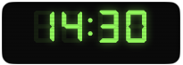
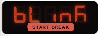
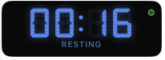
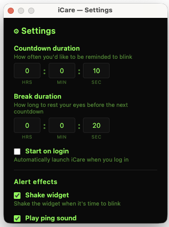

# 👁️ iCare

> 🖥️ A dead-simple, no-frills desktop blink reminder. Nothing fancy — just a tiny timer that tells you to blink.

No accounts. No cloud sync. No analytics. No bloat. Just a small always-on-top widget with a retro seven-segment countdown. When it hits zero, it flashes red — you blink, take a short break, and the cycle starts again. That's it.

---

## 📸 Screenshots

| Countdown | Alert | Break | Settings |
|---|---|---|---|
|  |  |  |  |

<!-- To add your own screenshots:
  1. Create the folder: mkdir -p docs/screenshots
  2. Save your screenshots as:
     - docs/screenshots/countdown.png  (green timer counting down)
     - docs/screenshots/alert.png      (red flashing "BLINK" state)
     - docs/screenshots/break.png      (blue resting countdown)
     - docs/screenshots/settings.png   (settings panel)
  3. Optionally add more:
     - docs/screenshots/tray.png       (system tray menu)
     - docs/screenshots/shake.png      (widget shaking)
-->

---

## ✨ Features

- 🟢 **Retro LCD aesthetic** — green-phosphor seven-segment digits with ghost segments, scanlines, and a blinking colon
- 🔄 **Three-state cycle** — Countdown → Alert (flash red, wait for click) → Break (rest your eyes) → repeat
- ⚙️ **Configurable** — countdown duration, break duration, start on login
- 🔔 **Alert effects** — optional shake animation, ping sound on alert, and pong sound when break ends
- 🖱️ **System tray** — show/hide, pause/resume, settings, quit
- 💻 **Cross-platform** — macOS and Windows
- 🪶 **Lightweight** — frameless, transparent, always-on-top, no dock/taskbar clutter

---

## 🚀 Getting Started

```bash
# Install dependencies
npm install

# Run in development mode
npm run dev

# Build only (no launch)
npm run build
```

---

## 📦 Packaging

```bash
# 🍎 macOS (DMG)
npm run package:mac

# 🪟 Windows (NSIS installer)
npm run package:win
```

### 🍎 macOS — "app is damaged" warning

macOS Gatekeeper blocks unsigned apps. After installing iCare from the DMG, run:

```bash
xattr -cr /Applications/iCare.app
```

Then open the app as normal. This only needs to be done once.

---

## 🏷️ Creating a Release

Releases are built automatically via GitHub Actions. To create a new release:

### 1️⃣ Tag the version

```bash
# Update the version in package.json first, then:
git add package.json
git commit -m "chore: bump version to 1.0.1"
git tag v1.0.1
git push origin main --tags
```

### 2️⃣ Create the GitHub release

Using the GitHub CLI:

```bash
gh release create v1.0.1 --title "v1.0.1" --notes "Release notes here"
```

Or via the GitHub web UI:

1. Go to **https://github.com/faesel/icare/releases**
2. Click **Draft a new release**
3. Choose the tag you just pushed (e.g. `v1.0.1`)
4. Add a title and description
5. Click **Publish release** 🎉

### 3️⃣ What happens next

Once the release is published, the CI workflow (`.github/workflows/release.yml`) automatically:

- 🍎 **macOS job** — builds on `macos-latest`, packages a `.dmg`, and uploads it to the release
- 🪟 **Windows job** — builds on `windows-latest`, packages an `.exe` NSIS installer, and uploads it to the release

Both jobs run in parallel. After a few minutes the built artefacts will appear as downloadable assets on the release page.

---

## ⚙️ Configuration

Click the ⚙ icon on the widget (appears on hover) or right-click the tray icon → Settings.

| Setting | Default | Description |
|---|---|---|
| ⏱️ Countdown duration | 20 min | How often you're reminded to blink |
| 😌 Break duration | 20s | How long the rest period lasts |
| 🔁 Start on login | Off | Auto-launch iCare when you log in |
| 📳 Shake widget | On | Shake the widget on alert |
| 🔔 Ping sound | On | Audible ping when it's time to blink |
| 🔕 Pong sound | On | Audible pong when the break ends |

---

## 📄 Licence

This project is licensed under the [MIT Licence](LICENCE).
