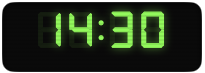
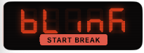
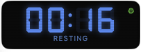
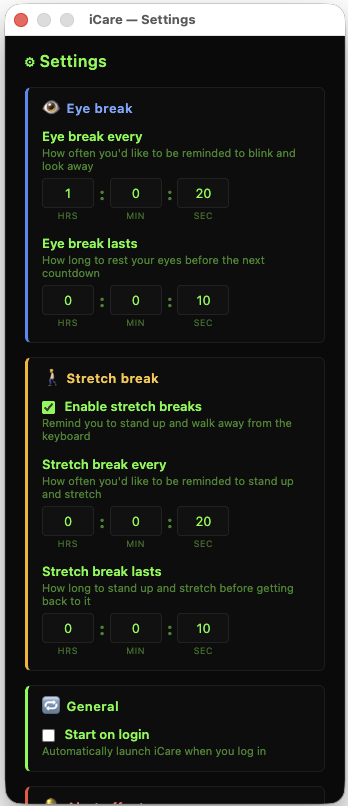
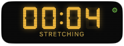

# 👁️ iCare

> 🖥️ A dead-simple, no-frills desktop blink reminder. Nothing fancy — just a tiny timer that tells you to blink.

No accounts. No cloud sync. No analytics. No bloat. Just a small always-on-top widget with a retro seven-segment countdown. When it hits zero, it flashes red — you blink, take a short break, and the cycle starts again. That's it.

---

## 📸 Screenshots

| Countdown | Alert | Break | Settings |
|---|---|---|---|
|  |  |  |  |

### 🆕 Stretch break

<!-- 📷 SCREENSHOT PLACEHOLDER — add your stretch break screenshot here:
     Save it as docs/screenshots/stretch-break.png, then replace the line
     below with:  -->

_📷 Screenshot coming soon — capture the amber **stretch break** state and the new **Stretch break** settings section, then drop the image in `docs/screenshots/stretch-break.png`._

<!-- To add your own screenshots:
  1. Create the folder: mkdir -p docs/screenshots
  2. Save your screenshots as:
     - docs/screenshots/countdown.png      (green timer counting down)
     - docs/screenshots/alert.png          (red flashing "BLINK" state)
     - docs/screenshots/break.png          (blue resting countdown)
     - docs/screenshots/settings.png       (settings panel)
     - docs/screenshots/stretch-break.png  (amber "WALK" stretch break)
  3. Optionally add more:
     - docs/screenshots/tray.png           (system tray menu)
     - docs/screenshots/shake.png          (widget shaking)
-->

---

## ✨ Features

- 🟢 **Retro LCD aesthetic** — green-phosphor seven-segment digits with ghost segments, scanlines, and a blinking colon
- 👁️ **Eye break** — Countdown → Alert (flash red, wait for click) → Eye break (rest your eyes) → repeat
- 🚶 **Stretch break** — an optional, independent reminder to stand up and walk away from the keyboard, with its own interval and duration. Starts with a ping prompt and ends with a series of pongs to call you back
- ⚙️ **Configurable** — eye break interval & length, stretch break interval & length, start on login
- 🔔 **Alert effects** — optional shake animation, ping sound on alert, and pong sound when a break ends
- 🖱️ **System tray** — show/hide, pause/resume, settings, quit
- 💻 **Cross-platform** — macOS and Windows
- 🪶 **Lightweight** — frameless, transparent, always-on-top, no dock/taskbar clutter

---

## 🚀 Getting Started

```bash
# Install dependencies
npm install

# Run in development mode
npm run dev

# Build only (no launch)
npm run build
```

---

## 📦 Packaging

```bash
# 🍎 macOS (DMG)
npm run package:mac

# 🪟 Windows (NSIS installer)
npm run package:win
```

### 🍎 macOS — "app is damaged" warning

macOS Gatekeeper blocks unsigned apps. After installing iCare from the DMG, run:

```bash
xattr -cr /Applications/iCare.app
```

Then open the app as normal. This only needs to be done once.

---

## 🏷️ Creating a Release

Releases are built automatically via GitHub Actions. To create a new release:

### 1️⃣ Tag the version

```bash
# Update the version in package.json first, then:
git add package.json
git commit -m "chore: bump version to 1.0.1"
git tag v1.0.1
git push origin main --tags
```

### 2️⃣ Create the GitHub release

Using the GitHub CLI:

```bash
gh release create v1.0.1 --title "v1.0.1" --notes "Release notes here"
```

Or via the GitHub web UI:

1. Go to **https://github.com/faesel/icare/releases**
2. Click **Draft a new release**
3. Choose the tag you just pushed (e.g. `v1.0.1`)
4. Add a title and description
5. Click **Publish release** 🎉

### 3️⃣ What happens next

Once the release is published, the CI workflow (`.github/workflows/release.yml`) automatically:

- 🍎 **macOS job** — builds on `macos-latest`, packages a `.dmg`, and uploads it to the release
- 🪟 **Windows job** — builds on `windows-latest`, packages an `.exe` NSIS installer, and uploads it to the release

Both jobs run in parallel. After a few minutes the built artefacts will appear as downloadable assets on the release page.

---

## ⚙️ Configuration

Click the ⚙ icon on the widget (always visible, top-right) or right-click the tray icon → Settings.

| Setting | Default | Description |
|---|---|---|
| 👁️ Eye break every | 20 min | How often you're reminded to blink and look away |
| 😌 Eye break lasts | 20s | How long the eye rest period lasts |
| 🚶 Enable stretch breaks | Off | Turn the walk-away-from-keyboard reminder on or off |
| ⏰ Stretch break every | 1 hr | How often you're reminded to stand up and stretch |
| 🧘 Stretch break lasts | 5 min | How long the stretch break lasts |
| 🔁 Start on login | Off | Auto-launch iCare when you log in |
| 📳 Shake widget | On | Shake the widget on alert |
| 🔔 Ping sound | On | Audible ping when a break is due |
| 🔕 Pong sound | On | Audible pong when a break ends (×5 for stretch breaks) |

---

## 📄 Licence

This project is licensed under the [MIT Licence](LICENCE).
